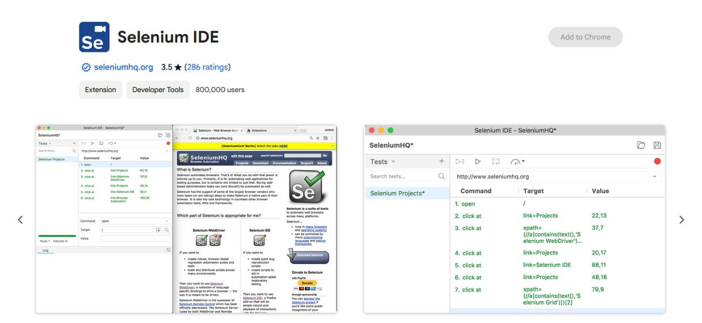
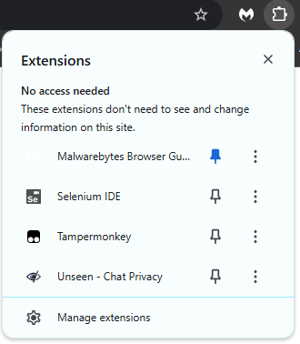
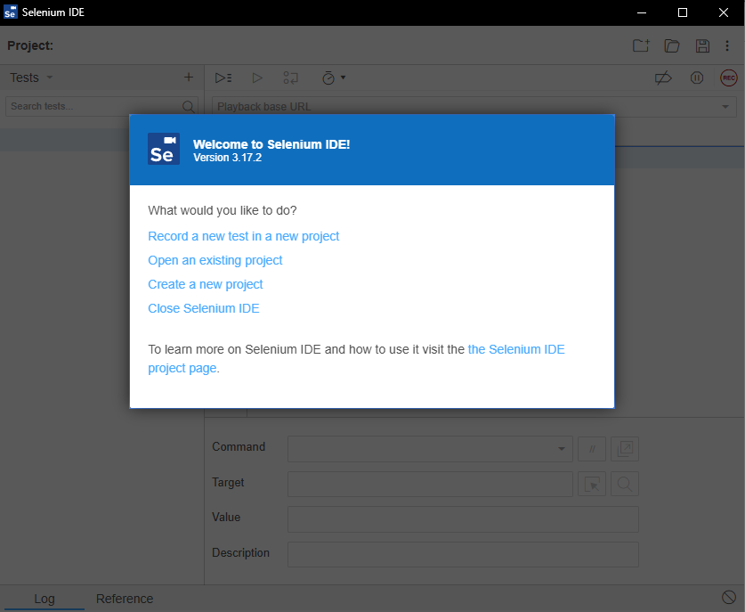
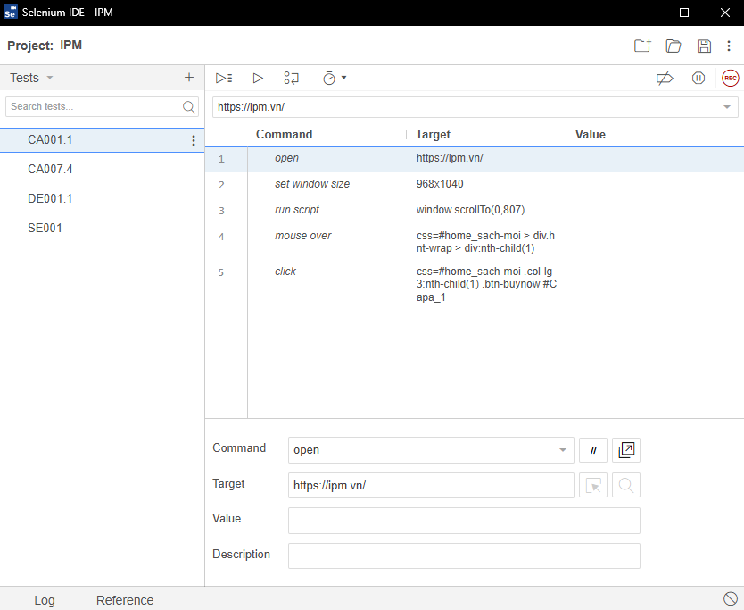
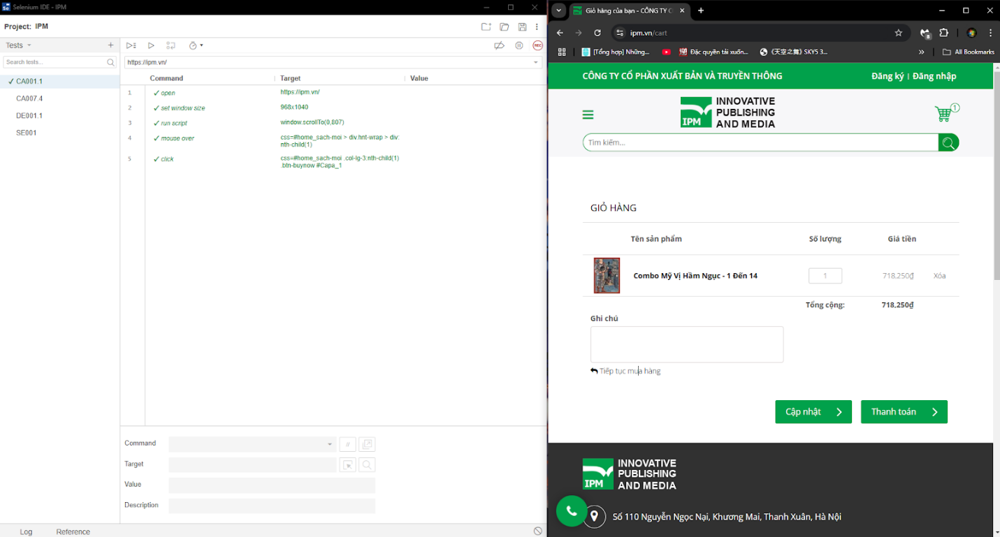
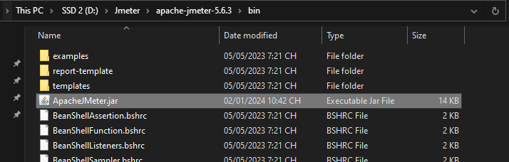
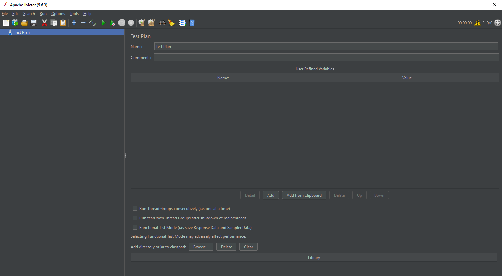

# 📂 Danh sách file kiểm thử

- **`README.MD`**: Bài báo cáo toàn bộ nội dung của quá trình kiểm thử.
- **`Quản Lý Test Case.xlsx`**: [Trang tính] dùng để quản lý các ca kiểm thử.
- **`Test case - Function.pdf`**: [Sheet Function] của file **Quản Lý Test Case.xlsx** được xuất ra dạng PDF để dễ đọc hơn.  
- **`Test case - UI.pdf`**: [Sheet UI] của file **Quản Lý Test Case.xlsx** được xuất ra dạng PDF để dễ đọc hơn.  
- **`Test case - Performance.pdf`**: [Sheet Performance] của file **Quản Lý Test Case.xlsx** được xuất ra dạng PDF để dễ đọc hơn.  
- **Video minh họa**: Xem video minh họa một số ca kiểm thử trong file **Quản Lý Test Case.xlsx** tại [đây](https://youtu.be/8H83n4a972w).  
- **`ipm.jmx`**: [Kịch bản kiểm thử] dạng file script của **Apache JMeter**.  
- **`keywords.csv`** & **`p_number.csv`**: Dữ liệu dùng để kiểm thử ([từ khóa] và [số trang] trong **Apache JMeter**.  
- **`IPM.side`**: [Kịch bản kiểm thử] dạng file script của **Selenium IDE**.  

> **⚠ Lưu ý:**  
> Nếu thời điểm chạy file **`IPM.side`** không nằm trong khoảng **19-22/12/2024**, hãy xóa dòng lệnh (dùng để tắt pop-up khuyến mãi) sau trong mỗi test case kiểm thử chức năng để file kiểm thử có thể chạy bình thường:  
>  
> ```plaintext
> click: xpath=//*[@id="popup-contact"]/div/div/div/button

#  1. Selenium

## 1.1. Giới thiệu Selenium

Selenium là một bộ công cụ mã nguồn mở phổ biến được sử dụng rộng rãi trong kiểm thử tự động trên các ứng dụng web. Được phát triển đầu tiên vào năm 2004 bởi Jason Huggins, Selenium giúp các nhà kiểm thử tự động hóa các tác vụ trên trình duyệt, như điều hướng qua các trang, nhấn nút, nhập liệu và kiểm tra tính năng của ứng dụng.

## 1.2. Các thành phần chính của Selenium

- **Selenium WebDriver**: là thành phần chính của bộ công cụ, cung cấp một API mạnh mẽ để điều khiển trực tiếp trình duyệt trên các hệ điều hành khác nhau mà không yêu cầu bất kỳ phần mềm trung gian nào. Điều này làm cho Selenium trở thành công cụ phù hợp để thực hiện kiểm thử chức năng và kiểm tra tính tương thích của ứng dụng trên các trình duyệt khác nhau.
- **Selenium Grid**: cho phép thực hiện các kiểm thử song song trên nhiều môi trường, giúp tiết kiệm thời gian kiểm thử và tối ưu hóa quá trình kiểm thử liên tục (Continuous Testing) trong DevOps.
- **Selenium IDE**: là một công cụ tiện lợi giúp phát triển các ca kiểm thử web. Nó hoạt động như một tiện ích mở rộng cho trình duyệt Chrome hoặc Firefox, cho phép người dùng ghi lại các thao tác của mình trên website và chuyển chúng thành các câu lệnh "Selenese" (ngôn ngữ kịch bản dạng HTML của Selenium), giúp người kiểm thử nhanh chóng xây dựng và kiểm tra các kịch bản. Selenium IDE cũng hỗ trợ lưu kịch bản dưới nhiều ngôn ngữ lập trình, tiết kiệm thời gian và tăng hiệu quả kiểm thử.

## 1.3. Cách chạy kịch bản Selenium IDE

- **Bước 1:** Mở trình duyệt Chrome hoặc Firefox và cài đặt Selenium IDE.


<sub><center>Hình 1: Giao diện của Selenium IDE trong Google Store </center></sub>
- **Bước 2:** Chọn biểu tượng Selenium IDE trên thanh công cụ trình duyệt.


<sub><center>Hình 2: Giao diện khi mở thanh công cụ của trình duyệt </center></sub>

- **Bước 3:** Chọn "Open an existing project" và mở file kịch bản `.side`


<sub><center>Hình 3: Giao diện khi mở Selenium IDE </center></sub>


<sub><center>Hình 4: Giao diện sau khi tải kịch bản kiểm thử lên Selenium IDE </center></sub>

- **Bước 4:** Nhấn `Ctrl+Shift+R` để chạy tất cả các ca kiểm thử hoặc `Ctrl+R` để chạy ca kiểm thử hiện tại.



<sub><center>Hình 5: Giao diện sau khi chạy xong ca kiểm thử </center></sub>

## 1.4. Một số lệnh quan trọng

### Assert  
- **Chức năng**: Xác minh rằng một điều kiện cụ thể đúng, nếu không, quá trình kiểm thử sẽ dừng lại.  
- **Target**: Giá trị hoặc điều kiện cần kiểm tra.  
- **Value**: Không bắt buộc, thường là giá trị mong đợi.  

### Assert Element Present  
- **Chức năng**: Xác minh rằng một phần tử cụ thể có mặt trên trang. Nếu không, quá trình kiểm thử sẽ dừng lại.  
- **Target**: XPath hoặc CSS selector của phần tử.  
- **Value**: Không sử dụng.  

### Assert Not Text  
- **Chức năng**: Kiểm tra rằng một phần tử không chứa văn bản cụ thể.  
- **Target**: XPath hoặc CSS selector của phần tử.  
- **Value**: Văn bản không mong muốn xuất hiện.  

### End  
- **Chức năng**: Kết thúc một khối lệnh trong các cấu trúc điều kiện hoặc vòng lặp.  
- **Target**: Không sử dụng.  
- **Value**: Không sử dụng.  

### Click  
- **Chức năng**: Mô phỏng hành động nhấp chuột vào một phần tử.  
- **Target**: XPath hoặc CSS selector của phần tử.  
- **Value**: Không sử dụng.  

### Mouse Over  
- **Chức năng**: Di chuyển chuột qua một phần tử mà không nhấp vào nó.  
- **Target**: XPath hoặc CSS selector của phần tử.  
- **Value**: Không sử dụng.  

### Open  
- **Chức năng**: Mở một URL cụ thể trong trình duyệt.  
- **Target**: Đường dẫn URL.  
- **Value**: Không sử dụng.  

### Pause  
- **Chức năng**: Tạm dừng quá trình kiểm thử trong khoảng thời gian nhất định.  
- **Target**: Thời gian tạm dừng (đơn vị: mili giây).  
- **Value**: Không sử dụng.  

### Run Script  
- **Chức năng**: Chạy một đoạn mã JavaScript tùy chỉnh.  
- **Target**: Đoạn mã JavaScript.  
- **Value**: Không sử dụng.  

### Send Keys  
- **Chức năng**: Nhập văn bản vào một trường nhập liệu hoặc gửi các phím đặc biệt.  
- **Target**: XPath hoặc CSS selector của trường nhập liệu.  
- **Value**: Văn bản hoặc tổ hợp phím.  

### Set Window Size  
- **Chức năng**: Đặt kích thước của cửa sổ trình duyệt.  
- **Target**: Chiều rộng và chiều cao (ví dụ: `1920x1080`).  
- **Value**: Không sử dụng.  

### Store Xpath Count  
- **Chức năng**: Đếm số lượng phần tử khớp với XPath và lưu giá trị này vào biến.  
- **Target**: XPath của phần tử.  
- **Value**: Tên biến để lưu trữ kết quả.  

### Type  
- **Chức năng**: Nhập văn bản vào một trường nhập.  
- **Target**: XPath hoặc CSS selector của trường nhập liệu.  
- **Value**: Văn bản muốn nhập.  

### Verify Element Present  
- **Chức năng**: Kiểm tra xem một phần tử có xuất hiện trên trang hay không. Không làm quá trình kiểm thử dừng nếu kiểm tra thất bại.  
- **Target**: XPath hoặc CSS selector của phần tử.  
- **Value**: Không sử dụng.  

### While  
- **Chức năng**: Thực hiện một vòng lặp nhiều lần dựa trên điều kiện logic cho đến khi điều kiện không còn đúng.  
- **Target**: Điều kiện logic viết dưới dạng mã JavaScript.  
- **Value**: Không sử dụng.  
---

# 2. JMeter

## 2.1. Giới thiệu Selenium

JMeter là một công cụ kiểm thử hiệu năng mã nguồn mở, được sử dụng rộng rãi để đánh giá hiệu suất của các ứng dụng web, di động và hệ thống phân tán. Nó hoạt động bằng cách tạo các yêu cầu tải để thử nghiệm, đo lường thời gian phản hồi và cung cấp báo cáo chi tiết về các chỉ số như thống kê lỗi, sử dụng tài nguyên.

## 2.2. Khả năng nổi bật của JMeter:

- **Đánh giá hiệu suất ứng dụng:** JMeter có thể tạo các yêu cầu tải, đo thời gian phản hồi và xác định mức độ ổn định của ứng dụng.
- **Mô phỏng hành vi người dùng:** JMeter cho phép mô phỏng hành vi người dùng, bao gồm đăng nhập, thao tác giao diện và thực hiện tác vụ, để phân tích hiệu suất theo từng hành vi cụ thể.
- **Kiểm thử hệ thống phân tán:** JMeter có thể đo lường hiệu suất của các hệ thống đa máy chủ, bao gồm các hệ thống phân tán và đám mây.
- **Hỗ trợ nhiều giao thức:** JMeter hỗ trợ nhiều giao thức như HTTP, FTP, JDBC, và các API RESTful, SOAP, giúp kiểm thử đa dạng các ứng dụng.
- **Báo cáo chi tiết:** JMeter cung cấp báo cáo chi tiết về các chỉ số hiệu suất, bao gồm thống kê lỗi, thời gian phản hồi, sử dụng tài nguyên.
- **Mở rộng dễ dàng:** JMeter có thể mở rộng thông qua plugin hoặc script, với hỗ trợ các ngôn ngữ như Java, Groovy, JavaScript.
- **Tự động hóa kiểm thử:** JMeter có thể tự động hóa các kịch bản kiểm thử, giúp tiết kiệm thời gian và tăng độ chính xác.

## 2.3. Cách thức hoạt động của JMeter:

1. **Tạo kịch bản:** Xác định URL, phương thức HTTP, tham số yêu cầu.
2. **Cấu hình kiểm thử:** Cài đặt số lượng người dùng, thời gian tải và khoảng cách yêu cầu.
3. **Chạy kiểm thử:** Tiến hành gửi yêu cầu tải đến hệ thống.
4. **Phân tích kết quả:** Xem báo cáo về thời gian phản hồi, lỗi và tài nguyên.

## 2.4. Cách chạy kịch bản đã tạo của JMeter:

- **Bước 1:** Đảm bảo thiết bị đã cài đặt Java. Nếu chưa có, tải tại [đây](https://www.java.com/download/ie_manual.jsp).
- **Bước 2:** Tải và cài đặt Apache JMeter tại [đây](https://jmeter.apache.org/download_jmeter.cgi).
- **Bước 3:** Giải nén và chạy file `.jar` trong thư mục `/bin`.


<sub><center>Hình 6: Vị trí file khởi chạy Jmeter </center></sub>


<sub><center>Hình 7: Giao diện sau khi chạy thành công </center></sub>

- **Bước 4:** Chọn `File` → `Open` và mở file kịch bản JMeter có đuôi `.jmx`.

  

<sub><center>Hình 8: Giao diện sau khi mở file thành công </center></sub>

- **Bước 5:** Chọn biểu tượng ▶ để chạy kịch bản kiểm thử.


## 2.5. Giải thích về các thành phần trong kịch bản kiểm thử:

### **2.5.1. Test Plan**
- **Chức năng:** Thành phần gốc (root element) của một kịch bản kiểm thử trong JMeter.
- **Thành phần chính:**
  - **Thread Groups:** Xác định số lượng người dùng ảo (threads) và cách thức thực hiện kiểm thử.
  - **Listeners:** Thu thập và hiển thị kết quả kiểm thử.
- **Ví dụ:** Một Test Plan có thể chứa nhiều Thread Group để chạy các kịch bản bên trong.


### **2.5.2. Thread Group**
- **Chức năng:** Định nghĩa nhóm người dùng ảo (threads) mà JMeter sử dụng để kiểm thử. Mỗi thread mô phỏng một người dùng độc lập.
- **Thành phần chính:**
  - **Number of Threads:** Số lượng người dùng ảo.
  - **Ramp-Up Period:** Thời gian để khởi động toàn bộ số threads (đơn vị: giây).
  - **Loop Count:** Số lần lặp lại kịch bản kiểm thử.
- **Ví dụ:** 100 thread, ramp-up 30 giây, loop 2 sẽ mô phỏng 100 người dùng thực hiện các hành động trong vòng 30 giây và lặp lại 2 lần.


### **2.5.3. HTTP Request**
- **Chức năng:** Mô phỏng các yêu cầu HTTP đến server, giúp kiểm thử hiệu suất ứng dụng web.
- **Thành phần chính:**
  - **Server Name or IP:** Địa chỉ máy chủ.
  - **Path:** Đường dẫn URL.
  - **Method:** `GET, POST, PUT, DELETE`...
  - **Parameters:** Các tham số gửi trong yêu cầu.
  - **Headers:** Tiêu đề HTTP.
  - **Body Data:** Dữ liệu gửi kèm (thường dùng cho `POST`).

### **2.5.4. Summary Report**
- **Chức năng:** Cung cấp tổng quan về kết quả kiểm thử.
- **Thành phần chính:**
  - **# Sample:** Số lượng yêu cầu được gửi.
  - **Average:** Thời gian phản hồi trung bình.
  - **Min/Max:** Thời gian phản hồi nhỏ nhất/lớn nhất.
  - **Error %:** Tỷ lệ lỗi.
  - **Throughput:** Số lượng yêu cầu xử lý mỗi giây.
  - **Received/Sent KB/sec:** Dung lượng dữ liệu nhận/gửi mỗi giây.

### **2.5.5. View Result Tree**
- **Chức năng:** Hiển thị chi tiết kết quả của từng yêu cầu kiểm thử.
- **Thành phần chính:**
  - **Sampler Result:** Thông tin tổng quan về yêu cầu và phản hồi.
    - **Thread Name:** Tên thread đang chạy.
    - **Sample Start:** Thời điểm nhận phản hồi.
    - **Response Code:** Mã trạng thái HTTP (ví dụ: `200` - thành công, `404` - không tìm thấy).
    - **Response Message:** Thông điệp phản hồi (`OK`, `Not Found`...).
    - **Time:** Thời gian phản hồi (ms).
    - **Latency:** Thời gian từ khi gửi yêu cầu đến khi nhận phản hồi.
  - **Request Data:** Dữ liệu gửi đến server.
  - **Response Data:** Dữ liệu phản hồi từ server.
    - **Response Body:** Nội dung phản hồi (JSON, XML, HTML).
    - **Response Headers:** Các thông tin như loại nội dung, mã trạng thái.


### **2.5.6. CSV Data Set Config**
- **Chức năng:** Đọc dữ liệu từ file CSV và sử dụng trong các yêu cầu HTTP.
- **Thành phần chính:**
  - **File Name:** Đường dẫn file CSV.
  - **Variable Names:** Tên biến ánh xạ các cột trong CSV.
  - **Delimiter:** Ký tự phân cách (mặc định là `,`).
  - **Recycle on EOF:** Xác định có quay lại từ đầu file sau khi đọc hết không.
  - **Stop thread on EOF:** Có dừng thread khi đọc hết tệp không.

---

# 3. Kiểm thử website IPM.vn

# 3.1. Phân tích yêu cầu kiểm thử website IPM.vn

## 3.1.1. Giới thiệu về IPM.vn

- **IPM.vn** là website bán sách của Công ty Cổ phần Xuất bản và Truyền thông IPM – một trong những đơn vị tiên phong tại Việt Nam trong việc tìm kiếm, khai thác và mua bản quyền sách nước ngoài để xuất bản. Được thành lập vào tháng 2 năm 2004, IPM ra đời từ sự đam mê và nhiệt huyết của nhóm sáng lập viên có nhiều năm kinh nghiệm trong lĩnh vực xuất bản. Với các đầu sách đa dạng và chất lượng, IPM.vn không chỉ cung cấp các tác phẩm nổi tiếng trong nước mà còn giới thiệu nhiều tựa sách quốc tế hấp dẫn đến độc giả Việt Nam.

- Bên cạnh việc cung cấp sách, IPM còn là đơn vị tiên phong trong lĩnh vực dịch vụ xuất bản chuyên nghiệp. Với đội ngũ biên tập, thiết kế, dàn trang và in ấn giàu kinh nghiệm, IPM cam kết mang đến những ấn phẩm chất lượng cao, đáp ứng mọi nhu cầu của khách hàng.

- Kể từ năm 2007, IPM đã đạt được nhiều thành tựu trong việc xuất bản các bộ tiểu thuyết nổi tiếng và bán chạy, trong đó có bộ *"Tru Tiên"* – tác phẩm kiếm hiệp nổi tiếng tại nhiều quốc gia châu Á. IPM luôn nỗ lực để mang đến cho độc giả những trải nghiệm đọc sách tốt nhất, góp phần nâng cao văn hóa đọc và phát triển thị trường sách Việt Nam.

## 3.1.2. Phân tích các yêu cầu về chức năng

- **Điều hướng trang chủ và các trang chính**:  
  Người dùng cần có thể truy cập vào trang chủ, danh mục sản phẩm, chi tiết sản phẩm, tin tức, và các trang liên hệ một cách dễ dàng.

- **Tìm kiếm và lọc sản phẩm**:  
  Người dùng cần chức năng tìm kiếm để tìm sản phẩm theo từ khóa và lọc/sắp xếp sản phẩm dựa trên các tiêu chí như danh mục, giá cả, tên và độ bán chạy.

- **Quản lý tài khoản**:  
  Người dùng có thể đăng ký tài khoản, đăng nhập, đặt lại mật khẩu và quản lý thông tin cá nhân (như mật khẩu, địa chỉ).

- **Giỏ hàng và thanh toán**:  
  Người dùng cần có khả năng thêm sản phẩm vào giỏ hàng, thay đổi phiên bản muốn mua của loại sách đó, xem lại giỏ hàng, cập nhật số lượng, và tiến hành thanh toán với cả 2 hình thức **COD** (thanh toán khi nhận hàng) và **chuyển khoản qua ngân hàng**.

- **Hỗ trợ liên hệ**:  
  Người dùng cần có khả năng liên hệ qua form hoặc các kênh hỗ trợ khác (như điện thoại, email) một cách thuận tiện. Tính năng phải đảm bảo thông tin gửi đi được lưu trữ hoặc gửi đến bộ phận hỗ trợ chính xác.

## 3.1.3. Các yêu cầu phi chức năng

- **Hiệu suất và tốc độ tải trang**:  
  Website cần phản hồi nhanh, với thời gian tải trang không quá 3 giây để giữ trải nghiệm người dùng mượt mà.

- **Tương thích trên nhiều nền tảng**:  
  Website cần hoạt động hiệu quả trên các trình duyệt chính (Chrome, Firefox, Edge) và các thiết bị khác nhau (máy tính, điện thoại).

- **Bảo mật thông tin**:  
  Đảm bảo các dữ liệu nhạy cảm như thông tin đăng nhập, thông tin thanh toán được bảo vệ bằng giao thức `HTTPS` hay mã hóa `SSL` kết hợp với quy trình bảo mật khác.

- **Tính ổn định**:  
  Đảm bảo website duy trì hoạt động ổn định mà không bị gián đoạn, giảm thiểu thời gian chết (downtime) và xử lý sự cố hiệu quả.

- **Hỗ trợ hoạt động tối ưu SEO**:  
  Đảm bảo website có thể hiển thị một cách hiệu quả trên các công cụ tìm kiếm.


# 3.2. Lập kế hoạch kiểm thử

## 3.2.1. Mục tiêu

- Đảm bảo website hoạt động chính xác, hiệu quả.
- Xác minh website tương thích với các thiết bị, trình duyệt và hệ điều hành phổ biến.
- Kiểm tra tất cả các tính năng của website, đặc biệt là các tính năng chính như trang chủ, sản phẩm, thanh toán, và chức năng tìm kiếm.
- Đánh giá độ thân thiện với người dùng.

## 3.2.2. Phạm vi  

- **Chức năng chính**:
  - Trang chủ, danh mục sản phẩm, trang chi tiết sản phẩm, trang tin tức, giỏ hàng, thanh toán, và trang liên hệ.
  - Chức năng tìm kiếm, hiển thị sản phẩm theo danh mục, bộ lọc, và sắp xếp sản phẩm.
  - Các chức năng liên quan đến tài khoản người dùng: đăng ký, đăng nhập, và quản lý thông tin cá nhân.

- **Kiểm thử giao diện**:
  - Kiểm tra giao diện người dùng, định dạng văn bản, hình ảnh, bố cục khi thay đổi kích thước cửa sổ và trên các thiết bị khác nhau.

- **Kiểm thử hiệu năng**:
  - Tốc độ tải trang, độ ổn định khi có nhiều người truy cập đồng thời.

## 3.2.3. Chiến lược kiểm thử

- **Kiểm thử hộp đen**:  
  - Kiểm thử từng chức năng của trang web để đảm bảo chúng hoạt động đúng như mong đợi.  
  - Phần lớn các trường hợp kiểm thử chức năng (ví dụ: tìm kiếm sản phẩm, quy trình thanh toán) sẽ được thiết kế dựa trên phương pháp này.

- **Kiểm thử giao diện**:  
  - Thông qua người dùng thực tế để đánh giá trải nghiệm người dùng (UX) và giao diện người dùng (UI) để đảm bảo website thân thiện và dễ sử dụng.

- **Kiểm thử hiệu năng**:  
  - Sử dụng công cụ **JMeter** để kiểm thử tải và khả năng chịu tải.

- **Kiểm thử khả năng tương thích**:  
  - Đảm bảo website tương thích với các trình duyệt (Chrome, Firefox, Edge) và các thiết bị khác nhau (máy tính bàn, điện thoại di động).

## 3.2.4. Tài nguyên

- **Thiết bị kiểm thử**:
  - Máy tính bàn: `Intel Core I3 4130, 8GB RAM, Windows 10`.

- **Công cụ**:
  - **Công cụ kiểm thử tự động các chức năng**: Selenium (phiên bản `3.17.2`).
  - **Công cụ kiểm thử giao diện**: Lambda Test.
  - **Công cụ kiểm thử hiệu năng**: Apache JMeter (phiên bản `5.6.3`).
  - **Công cụ quản lý kiểm thử**: Google Sheets.

- **Tài liệu kiểm thử**:
  - Biểu mẫu quản lý các ca kiểm thử trên Google Sheets bao gồm 145 ca kiểm thử.
  - File kịch bản minh họa một số ca kiểm thử chức năng bằng Selenium IDE được lưu trong file `IPM.side`.
  - File kịch bản minh họa một số ca kiểm thử hiệu năng bằng Apache JMeter được lưu trong file `ipm.jmx`.

## 3.2.5. Môi trường kiểm thử

- **Hệ điều hành**:
  - Máy tính: Windows 10.
  - Điện thoại di động: Android 13.

- **Trình duyệt web**:
  - Google Chrome (phiên bản `131.0.6778.109`).

## 3.2.6. Rủi ro

- Website có thể không hoạt động chính xác theo thiết kế.
- Website có thể không hoạt động hiệu quả trên tất cả các thiết bị.
- Website có thể khó sử dụng.


## 3.2.7. Thiết kế các ca kiểm thử

Sau khi phân tích các yêu cầu chức năng và phi chức năng, ta tiến hành thiết kế các ca kiểm thử.

### Tìm kiếm sản phẩm
- **SE001** Tìm kiếm chính xác: Nhập tên sản phẩm chính xác vào thanh tìm kiếm và nhận kết quả phù hợp.
- **SE002** Tìm kiếm từ khóa không liên quan: Nhập từ khóa không liên quan đến bất kỳ sản phẩm nào trên website và nhận thông báo "Không tìm thấy kết quả."
- **SE003** Tìm kiếm từ khóa không đầy đủ: Nhập từ khóa tìm kiếm không chính xác hoàn toàn (chứa từ khóa liên quan) và hệ thống gợi ý các sản phẩm có liên quan.
- **SE004** Lọc sản phẩm theo danh mục: Sử dụng bộ lọc theo danh mục trong trang “Tất cả sản phẩm” và so sánh danh sách sản phẩm xuất hiện với database.
- **SE005** Chức năng sắp xếp sản phẩm theo tên: Sử dụng chức năng sắp xếp sản phẩm theo tên từ A-Z và từ Z-A trong trang “Tất cả sản phẩm” và so sánh danh sách sản phẩm xuất hiện với database.
- **SE006** Chức năng sắp xếp sản phẩm theo giá: Sử dụng chức năng sắp xếp sản phẩm theo giá tăng dần và giảm dần trong trang “Tất cả sản phẩm” và so sánh danh sách sản phẩm xuất hiện với database.
- **SE007** Chức năng sắp xếp sản phẩm theo thời gian ra mắt: Sử dụng chức năng sắp xếp sản phẩm theo mới nhất và muộn nhất trong trang “Tất cả sản phẩm” và so sánh danh sách sản phẩm xuất hiện với database.
- **SE008** Chức năng sắp xếp sản phẩm theo sản phẩm nổi bật: Sử dụng chức năng sắp xếp sản phẩm theo sản phẩm nổi bật trong trang “Tất cả sản phẩm” và so sánh danh sách sản phẩm xuất hiện với database.
- **SE009** Chức năng sắp xếp sản phẩm theo độ bán chạy: Sử dụng chức năng sắp xếp sản phẩm theo sản phẩm bán chạy nhất trong trang “Tất cả sản phẩm” và so sánh danh sách sản phẩm xuất hiện với database.

### Xem chi tiết sản phẩm
- **DE001** Xem chi tiết sản phẩm: Chọn một sản phẩm bất kỳ để vào xem trang chi tiết sản phẩm.
- **DE002** Chọn tùy chọn: Chọn các tùy chọn phiên bản (bản thường, bản đặc biệt, bản sưu tầm) của sản phẩm và xác nhận giá, thông tin sản phẩm, sau đó so sánh với dữ liệu trong database đảm bảo hiển thị chính xác.
- **DE003** Để lại bình luận sản phẩm: Bình luận một sản phẩm và xem bình luận xuất hiện.
- **DE004** Xem các bình luận theo thứ tự thời gian: Sử dụng chức năng sắp xếp thời gian.

### Giỏ hàng
- **CA001** Thêm sản phẩm từ trang chủ vào giỏ hàng.
- **CA002** Thêm sản phẩm từ trang “Tất cả sản phẩm” vào giỏ hàng.
- **CA003** Thêm sản phẩm còn hàng từ trang “Chi tiết sản phẩm” vào giỏ hàng.
- **CA004** Thêm sản phẩm hết hàng từ trang chủ vào giỏ hàng.
- **CA005** Thêm sản phẩm hết hàng từ trang “Tất cả sản phẩm” vào giỏ hàng.
- **CA006** Thêm sản phẩm hết hàng từ trang “Chi tiết sản phẩm” vào giỏ hàng.
- **CA007** Thay đổi số lượng sản phẩm trong giỏ hàng sau đó cập nhật.
- **CA008** Thay đổi số lượng sản phẩm trong giỏ hàng sau đó thanh toán.
- **CA009** Xóa sản phẩm trong giỏ hàng.

### Tài khoản người dùng
- **AC001** Đăng ký tài khoản với các thông tin bỏ trống.
- **AC002** Đăng ký tài khoản với email hợp lệ.
- **AC003** Đăng ký tài khoản với thông tin không hợp lệ.
- **AC004** Đăng nhập tài khoản đúng tài khoản và mật khẩu.
- **AC005** Đăng nhập tài khoản sai tài khoản/mật khẩu.
- **AC006** Chức năng quên mật khẩu.

### Đặt hàng và thanh toán
- **OR001** Đặt hàng khi chưa đăng nhập: Khi vào trang thanh toán sẽ phải nhập toàn bộ thông tin đặt hàng.
- **OR002** Đặt hàng khi đã đăng nhập: Khi vào trang thanh toán nếu trước đó tài khoản này đã từng đặt hàng thì thông tin đặt hàng sẽ được tự động điền sẵn.

### Giao diện người dùng (UI)
- **UI001** Trang chủ.
- **UI002** Trang tất cả sản phẩm.
- **UI003** Trang tin tức.
- **UI004** Trang về IPM.
- **UI005** Trang liên hệ.
- **UI006** Footer.

### Hiệu năng
- **PE001** Kiểm tra tốc độ tải trang chủ khi truy cập ipm.vn.
- **PE002** Kiểm tra tốc độ phản hồi sau khi tìm kiếm với từ khóa.
- **PE003** Kiểm tra tốc độ phản hồi khi duyệt các trang danh sách sản phẩm.

### Khả năng tương thích
Thực hiện tất cả ca kiểm thử ở trên với các trình duyệt khác nhau (Chrome, Firefox, Edge), trên các máy tính có hệ điều hành khác nhau (Windows, Linux), và trên các thiết bị di động (Android, iOS).

## 3.2.8. Thiết lập môi trường kiểm thử
Chuẩn bị môi trường kiểm thử như đã liệt kê ở phần lập kế hoạch kiểm thử.

## 3.2.9. Thực hiện kiểm thử
Chi tiết các ca kiểm thử được trình bày trong file `Quản Lý Test Case.xlsx` hoặc sử dụng các file `Test case – Function.pdf`để xem các ca kiểm thử chức năng, file `Test case – UI.pdf` để xem các ca kiểm thử giao diện, file `Test case – Performance.pdf` để xem các ca kiểm thử hiệu năng.

Video minh họa các ca kiểm thử đã được đính kèm với bài báo cáo này khi gửi hoặc truy cập vào đường dẫn sau: [MINH HỌA THỰC HIỆN CÁC CA KIỂM THỬ PHẦM MỀM TRÊN WEBSITE](https://youtu.be/8H83n4a972w) để xem.

### Các ca kiểm thử được minh họa trong video:
### **Kiểm thử chức năng**

- **SE001.1** Người dùng tìm kiếm sản phẩm bằng từ khóa chính xác, sau đó nhấn Enter để tìm kiếm.
- **SE001.2** Người dùng tìm kiếm sản phẩm bằng từ khóa chính xác, sau đó chọn biểu tượng 🔍 để tìm kiếm.
- **SE002.1** Người dùng tìm kiếm sản phẩm bằng từ khóa không liên quan, sau đó nhấn Enter để tìm kiếm.
- **SE002.2**:Người dùng tìm kiếm sản phẩm bằng từ khóa không liên quan, sau đó chọn biểu tượng 🔍 để tìm kiếm.
- **DE001.1** Xem chi tiết sản phẩm thông qua chức năng xem nhanh.
- **DE001.2** Xem chi tiết sản phẩm từ trang chi tiết sản phẩm của sản phẩm đó.
- **CA001.1** Thêm sản phẩm từ trang chủ vào giỏ hàng thông qua chức năng "Mua ngay".
- **CA007.4** Thay đổi số lượng của một sản phẩm đã có trong giỏ hàng thành 999 sản phẩm, sau đó chọn "Cập nhật".
- **AC001.1** Đăng ký tài khoản với thông tin ô "Họ" bỏ trống.
- **AC002** Đăng ký tài khoản với thông tin đầy đủ email hợp lệ.
- **AC004.3** Đăng nhập bằng tài khoản đã đăng ký trước đó.

### **Kiểm thử giao diện**

- **UI001.1 – UI001.9** Kiểm tra tất cả các thành phần trên "Trang chủ" hiển thị đầy đủ và đúng vị trí trên môi trường **Windows 10 - Google Chrome - Desktop 1920x1080**.
- **UI001.1 – UI001.9** Kiểm tra tất cả các thành phần trên "Trang chủ" hiển thị đầy đủ và đúng vị trí trên môi trường **Android 13 - Google Chrome - Xiaomi Mi 11**.

### **Kiểm thử hiệu năng**

- **PE001** Kiểm tra tốc độ tải trang chủ khi truy cập ipm.vn và tìm giới hạn chịu tải.
- **PE002** Kiểm tra tốc độ phản hồi sau khi tìm kiếm với từ khóa và tìm giới hạn chịu tải.
- **PE003** Kiểm tra tốc độ phản hồi khi duyệt các trang danh sách sản phẩm và tìm giới hạn chịu tải..


## **3.2.10. Tổng kết và đóng kiểm thử**

### **3.2.10.1. Kiểm thử chức năng**

- **Mục tiêu**: 
  - Các tính năng chính như tìm kiếm, xem chi tiết sản phẩm, giỏ hàng, đăng ký, đăng nhập, đặt hàng, thanh toán hoạt động đúng và hiệu quả.

- **Kết quả**:
  - Tổng số ca kiểm thử đã thực hiện: **69**.
  - Tổng số ca kiểm thử thành công (**Passed**): **66 (95.65%)**.
  - Tổng số ca kiểm thử thất bại (**Failed**): **3 (4.35%)**.
  - Tổng số ca kiểm thử đang còn phải xem xét (**In Progress**): **0 (0%)**.

- **Đánh giá**: 
  - Cần hoàn thiện chức năng quên mật khẩu, các ca kiểm thử thất bại còn lại không ảnh hưởng đến các chức năng chính.

### **3.2.10.2. Kiểm thử giao diện**

- **Mục tiêu**:
  - Giao diện hệ thống đảm bảo tính nhất quán trong các trang và các thành phần trên mỗi trang.
  - Các thành phần như menu điều hướng, các nút, biểu mẫu và thông báo có thể tương tác được và hoạt động chính xác.

- **Kết quả**:
  - Tổng số ca kiểm thử đã thực hiện: **69**.
  - Tổng số ca kiểm thử thành công (**Passed**): **69 (100%)**.
  - Tổng số ca kiểm thử thất bại (**Failed**): **0 (0%)**.
  - Tổng số ca kiểm thử đang còn phải xem xét (**In Progress**): **0 (0%)**.

- **Đánh giá**:
  - Nhìn chung, giao diện đạt yêu cầu về tính nhất quán, thẩm mỹ và dễ sử dụng cho phần lớn người dùng.

### **3.2.10.3. Kiểm thử hiệu năng**

- **Mục tiêu**:
  - Đánh giá khả năng chịu tải của hệ thống khi gặp lưu lượng người dùng cao thực hiện truy cập trang chủ, tìm kiếm sản phẩm và duyệt qua các trang danh sách sản phẩm.

- **Kết quả**:
  - Tổng số ca kiểm thử đã thực hiện: **18**.
  - Tổng số ca kiểm thử thành công (**Passed**): **12 (66.66%)**.
  - Tổng số ca kiểm thử thất bại (**Failed**): **6 (33.33%)**.
  - Tổng số ca kiểm thử đang còn phải xem xét (**In Progress**): **0 (0%)**.

- **Đánh giá**:
  - Hệ thống hoạt động tốt với lưu lượng truy cập dưới **750** người dùng đồng thời.
  - Khi lưu lượng truy cập gần chạm ngưỡng **750 - 1000** người, hệ thống bắt đầu gặp khó khăn.
  - Ở lưu lượng **1000+** người truy cập cùng lúc, hệ thống có khả năng cao sẽ bị **crash**.

